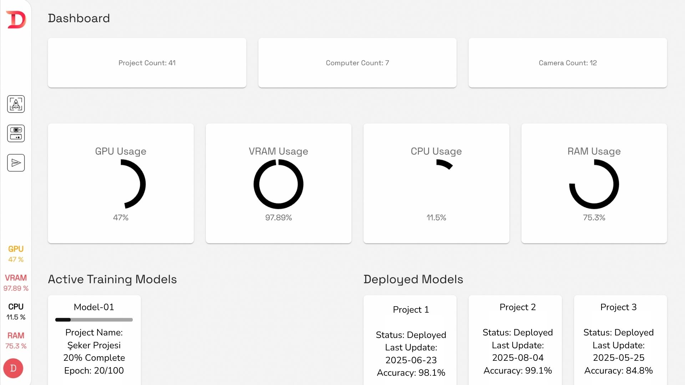
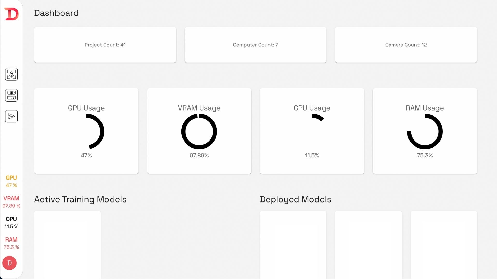
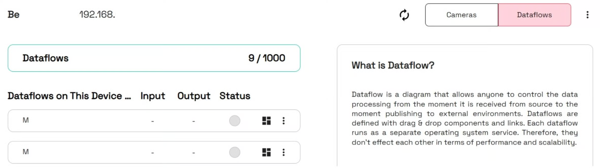
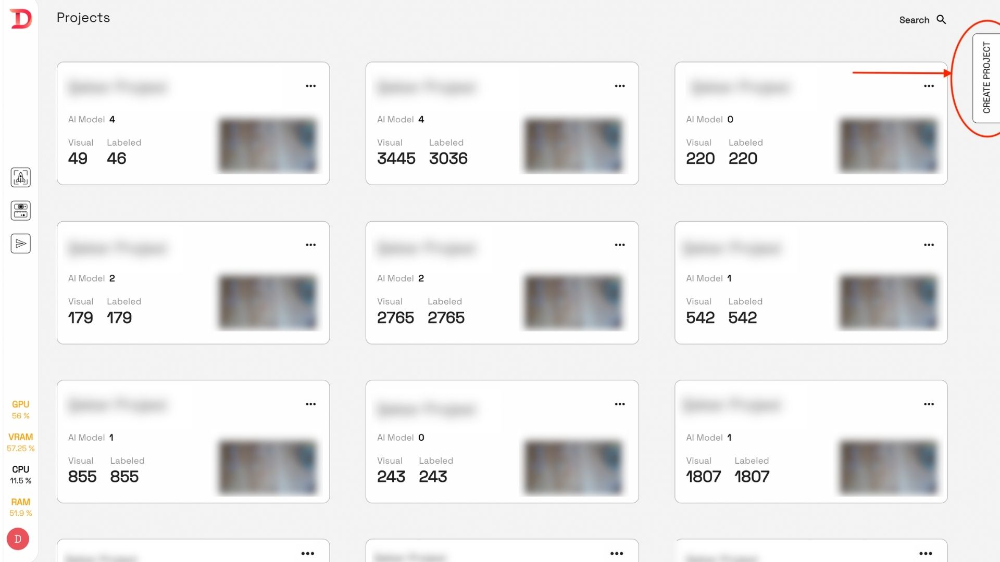

# 2. Başlangıç ve Arayüz

2.1 Uygulamaya Girme

Uygulamanın kurulu olduğu makinenin IP adresi:8002 ile tarayıcı üzerinden ağa bağlı olan herhangi bir bilgisayar erişebilir.

<figure><figcaption>
Giriş Sayfası
</figcaption></figure>

Giriş yapmak için herhangi bir hesap oluşturmanıza gerek yoktur. Kullanıcı adı ve şifre alanlarına **“demo”** yazarak uygulamaya kolayca erişebilirsiniz.

## 2.2 Arayüz

&#x20;        **2.2.1. Başlangıç ekranı:**&#x20;

&#x20;                **2.2.1.1. Dashboard:** Proje sayısı, bilgisayar sayısı ve kamera sayısını görebilirsiniz.

<figure><figcaption>
Temsili Dashboard Görünümü
</figcaption></figure>

Ayrıca GPU, vRAM, CPU ve RAM i ne kadar kullandığınızı yüzdelik olarak görebilirsiniz.

&#x20;                **2.2.1.2. Active Training Models:** Bu kısımda anlık olarak eğitilen modelin yüzdelik ve Epoch
\
olarak ne kadar eğitildiğini görebilirsiniz.

&#x20;               **2.2.1.3 Deployed Models:** Bu kısımda önceden eğitilmiş ve deploy edilmiş modellerin
\
durumunu son güncellemesini ve doğruluğunu görebilirsiniz.

&#x20;                **2.2.1.4 Başlangıç Ekranına Dönüş:** Herhangi bir anda başlangıç ekranına geri dönmek
\
için sol üst köşedeki "Dataguess" logosuna tıklayabilirsiniz.

&#x20;        **2.2.2. Computers:**    &#x20;

<figure><figcaption></figcaption></figure>

<figure><figcaption></figcaption></figure>

&#x20;                **2.2.2.1. Bilgisayarlar Sekmesine Giriş:** Sol üst köşedeki "Computers" ikonuna tıklayarak
&#x20;bilgisayarlar sekmesine geçiş yapabilirsiniz

&#x20;                **2.2.2.2. Bilgisayar Bilgileri:** Daha önce eklediğiniz bilgisayarları görüntüleyebilir ve her bir
\
bilgisayara bağlı kameraları görebilirsiniz. Kamera bilgileri arasında adı, türü, URL’si ve
\
canlı görüntüsü yer almaktadır.          &#x20;

<figure><figcaption>
Kamera Bilgileri
</figcaption></figure>

&#x20;                 **2.2.2.3. Dataflow:** "Dataflow" ikonuna tıklayarak makinenizdeki tüm dataflow'ları
\
görüntüleyebilirsiniz. Project Studio'da ilgili bilgisayara bağlı dataflow'ların portlarını
\
görebilir ve bu portlar aracılığıyla onlara erişebilirsiniz.&#x20;

&#x20; &#x20;

<figure><figcaption>
Dataflow Ekranı
</figcaption></figure>

&#x20;                 **2.2.2.4. Bilgisayar Ekleme:** Sağ taraftaki "Add Computer" sekmesinden yeni bir bilgisayar &#x20;
\
ekleyebilirsiniz. Bu işlem, başlangıç ekranındaki adımlarla aynıdır. "Add Computer"
\
butonunun altındaki kutucuğa tıklayarak IP kameralar ekleyebilirsiniz.

<figure><figcaption></figcaption></figure>

&#x20;        **2.2.3. Projects kısmı ve Projeler:** &#x20;

<figure><figcaption></figcaption></figure>

<figure><figcaption></figcaption></figure>

&#x20;          **2.2.3.1. Projelere Erişim:** Sol üstteki ikona tıklayarak "Projects" sekmesine
\
geçebilirsiniz. Mevcut projeleri sağ üstteki arama butonunu kullanarak isimlerine göre
\
bulabilirsiniz.

&#x20;          **2.2.3.2. Create Project:** Ekranın Sağ tarafındaki “Create Project” kısmına girip projenin adını
\
ve açıklamasını yazarak yeni proje oluşturabilirsiniz, açıklama yazmak isteğe bağlıdır.
&#x20;

Create ikonuna tıkladıktan sonra upload, label, train ve test aşamasına
&#x20;yönlendirileceksiniz.  &#x20;

<figure><figcaption></figcaption></figure>

<figure><figcaption></figcaption></figure>

&#x20;           **2.2.3.3. Proje Detayları:** Bir projeye tıkladığınızda, proje detaylarına erişebilirsiniz. Proje
&#x20;kutucuklarının sağ üst köşesindeki üç nokta (...) ikonuna tıklayarak projeyi inceleme
&#x20;(Inspect), projeyi kopyalama (Duplicate) veya projeyi silme (Delete) seçeneklerine
&#x20;ulaşabilirsiniz. Ayrıca, proje kutucuğuna tıklayarak doğrudan projeye girebilirsiniz.

&#x20;           **2.2.3.4. Upload, Label, Train ve Test:**

&#x20;                            **2.2.3.4.1. Veri Yükleme (Upload):** Bu konuyla ilgili detaylı bilgiyi kılavuzun "3. Veri
\
Yükleme" bölümünde bulabilirsiniz.
\
&#x20;                           **2.2.3.4.2. Etiketleme (Label):** Bu konuyla ilgili detaylı bilgiyi kılavuzun "4. Etiketleme"
\
bölümünde bulabilirsiniz.
\
&#x20;                           **2.2.3.4.3. Model Eğitme (Train):** Bu konuyla ilgili detaylı bilgiyi kılavuzun "5. Model
\
Eğitme" bölümünde bulabilirsiniz.
\
&#x20;                           **2.2.3.4.4. Model Değerlendirme  (Test):** Bu konuyla ilgili detaylı bilgiyi kılavuzun
\
"6. Model Değerlendirme" bölümünde bulabilirsiniz.

&#x20;        **2.2.4. Project Deploy:** &#x20;

Ekranın sol tarafındaki üç ikondan en alttaki ikona tıklayarak Project Deploy bölümüne
\
erişebilirsiniz. Project deploy işlemi ile ilgili detaylı bilgiye, bu kılavuzun "7. Dışa Dağıtım"
\
bölümünde ulaşabilirsiniz.

<figure><figcaption></figcaption></figure>

<figure><figcaption></figcaption></figure>

&#x20;      **2.2.5. Logout:**

Ekranın sol en alt bölümünde D sembolüne tıklayarak çıkış yapabilirsiniz.

<figure><figcaption></figcaption></figure>

Dataguess Teknoloji San. Ve Tic. A.Ş.
\ Zümrütevler Mah. Nazmi İlker Sok. No:3/3 34852 Maltepe/İstanbul
\ T: +90-216-912 1636 info@dataguess.com www.dataguess.com
