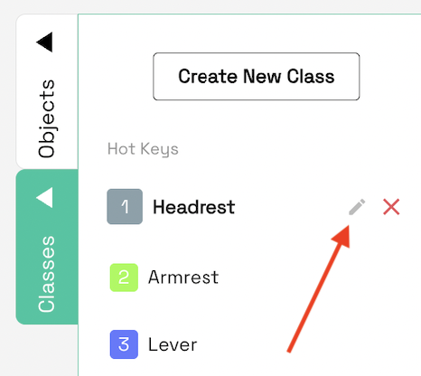
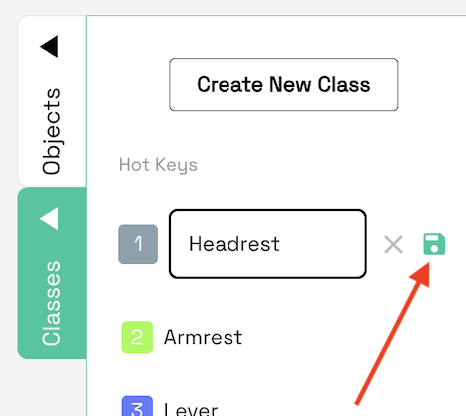

# 4. Labeling (Etiketleme Aşaması)

## 4.1 Etiket Oluşturma

Görüntü içerisinde bulunan her türlü nesne, durum ve algılanması gereken her türlü görüntü için etiketleme yapılabilir. Etiket oluşturmanın amacı yapay zeka modeline nesneyi ya da durumun tanıtımını yapmaktır. JPG, BMP veya PNG formatında görsel ya da MP4 formatında video yüklenebilir. Yükleme yapıldıktan sonra, etiketleme yapmak istediğiniz görsele ya da kareye tıklayıp, sağ taraftaki **Classes** sekmesinde bulunan **Create New Class** seçeniğini kullanarak yeni bir etiket oluşturabilirsiniz. Oluşturduktan sonra, **Classes** sekmesinde etiketin yan tarafında bulunan kalem kalem simgesi ile etiketin ismini ve rengini değiştirebilirsiniz. Bu işlemi yaptıktan sonra yeşil renkli tuşa basarak yeni ismi ve rengi kaydedebilirsiniz. Etiketi silmek için kalem simgesinin yanındaki **X** simgesinde basabilirsiniz. Etiketlerin sıralamasını yukarı ya da aşağı kaydırarak değiştirebilir, iki etiketin ortasında yeni bir etiket oluşturabilirsiniz.

<figure><figcaption>
Etiket oluşturmak ve etiketleri incelemek için Class butonuna basabilirsiniz
</figcaption></figure>

<figure><figcaption>
Her yeni etiket oluşturmak istediğinizde <strong>Create New Class tuşuna basabilirsiniz.</strong>
</figcaption></figure>

<figure><figcaption>
Etiketin ismini ve rengini değiştirmek için kalem tuşuna basabilirisiniz
</figcaption></figure>

<figure><figcaption>
Etiketin rengini isterseniz renk paletinden seçerek isterseniz renk kodu ile değiştirebilirsiniz.
</figcaption></figure>

<figure><figcaption>
Etikette isim ve renk değişikliği yapıldıktan sonra disket tuşuna basarak değişikliğinizi kaydedebilirsiniz.
</figcaption></figure>

## 4.2 Etiketleme Yapma

Ekranın üstündeki panelin en solunda bulunan ve kırpma işaretine benzeyen kutuya (Labeling Mode) tıkladığınızda, fare yardımıyla işaretleme yapabilirsiniz. Görseldeki nesneyi ya da durumu dikdörtgen içine alarak işaretleme işlemini gerçekleştirebilirsiniz. Bunun yanındaki el simgesi (Pan Mode), görseli kaydırmanıza, etikete tıkladığınızda etiketi oynatmanıza veya boyutunu değiştirmenize olanak sağlar.

<figure><figcaption></figcaption></figure>

<figure><figcaption>
Seçim yapma seçeneği
</figcaption></figure>

<figure><figcaption>
Seçim yapma
</figcaption></figure>

<figure><figcaption>
Seçim hareket ettirme seçeneği
</figcaption></figure>

Ayrıca, etiketleme işlemi sırasında kullanabileceğiniz kısayollar da mevcuttur:

* \`1\`, \`2\` ... \`8\`, \`9\` tuşları ile etiketler arasında geçiş yapabilirsiniz.
* \`W\` ve \`S\` tuşları ile etiketleme (Labeling) ve düzenleme (Pan Mode) modları arasında geçiş yapabilirsiniz.
* \`A\` ve \`D\` tuşları veya yön tuşları ile sonraki ve önceki frame'e geçiş yapabilirsiniz.

## 4.3 Art Arda Etiketleme

Özellikle fotoğraf ya da kare sayısı fazla olduğunda, her bir görsel için tek tek etikleme yapmak yerine, sabit nesnelerin etiketlenmesi için Tracking (etiketin konumunun ve boyutunun birebir sonraki karelere taşınması) özelliğimiz de mevcuttur. Bunu kullanmak için:

* Sağ sekmelerden **Objects** kısmını seçin.
* Tracklenmesi istenen etiketi seçin.
* Sağ üstte bulunan üç noktaya tıklayarak “Track” seçeneğini etkinleştirin.
* Sonraki fotoğraflara ya da karelere geçiş yaparak etiketin otomatik olarak takip edilmesini sağlayın.

Tracking ile işiniz bittiğinde (genellikle takip ettiğimiz objenin yeri değiştiğinde bu ayarı kapatıp tekrar başlatıyoruz), aynı adımları izleyerek Tracking ayarını kapatmayı unutmayın. Ayrıca, el simgesi (Pan Mode) ile nesneyi seçtikten sonra klavyedeki **T** tuşuna basarak Track ve Untrack işlemlerini yapabilirsiniz.

<figure><figcaption></figcaption></figure>

## 4.4 Etiketleri Kaydetme ve Düzenleme

Normalde, her bir fotoğraf ya da kare etiketlemesi sonrasında önceki veya sonraki kareye geçtiğinizde sistem otomatik olarak tüm etiketleri kaydeder. Çıkış yaparken kaydetmek isterseniz, yukarıdaki **X** butonuna bastığınızda **Yes** butonuna basarak etiketleri kaydedebilirsiniz.

Etiketleri düzenlemek için ise:

* Daha önce de belirtildiği gibi, etiketi oluşturduktan sonra düzenleme (kalem) simgesi aracılığıyla isim ve renk değişiklikleri yapabilirsiniz.
* Etiket sırasını değiştirmek için ilgili seçenekleri kullanabilirsiniz.

<figure><figcaption>
Etiketleri birbiri üstüne getirerek yerlerini değiştirebilirsiniz.
</figcaption></figure>

Dataguess Teknoloji San. Ve Tic. A.Ş.
\ Zümrütevler Mah. Nazmi İlker Sok. No:3/3 34852 Maltepe/İstanbul
\ T: +90-216-912 1636 info@dataguess.com www.dataguess.com
