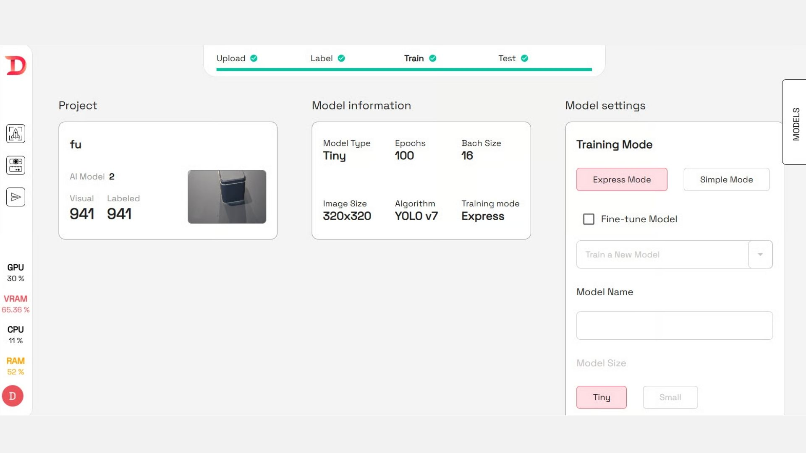
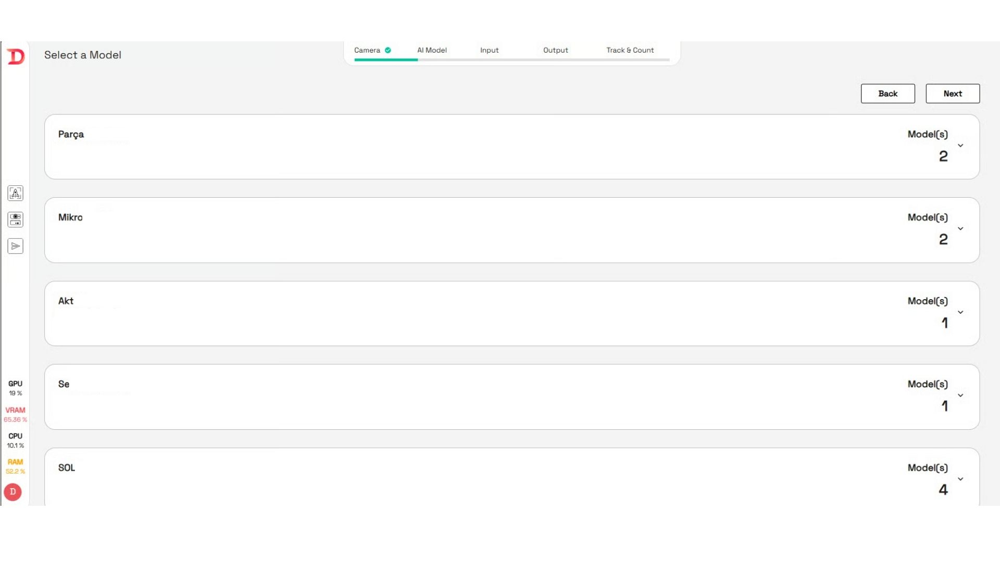
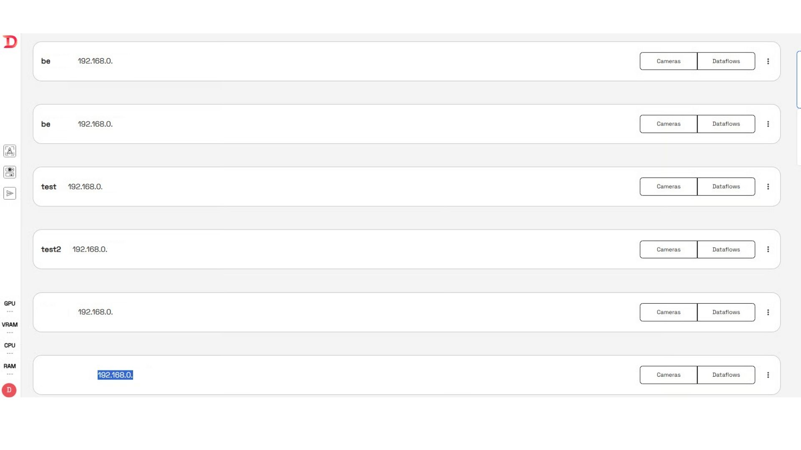

---
layout:
  title:
    visible: true
  description:
    visible: false
  tableOfContents:
    visible: true
  outline:
    visible: true
  pagination:
    visible: true
---

# 7. Canlı Test

Eğitilmiş bir yapay zeka modelini canlı ortamda test etmek ve dağıtmak (deploy etmek) için aşağıdaki adımlar takip edilmelidir:

#### **Deploy Butonuna Tıklanır**

* Ekranın alt kısmında yer alan **"DEPLOY"** butonuna tıklanarak dağıtım süreci başlatılır.

## 7.1 Model Adı

* Açılan pencerede, deploy edilecek modele bir isim verilir (örneğin: `FuarBox_Test_v1`).
* Bu isim, ileride modeli yönetmek ve tanımlamak için kullanılır.

<figure><figcaption></figcaption></figure>

## 7.2 Cihaz Seçimi (Edge Cihaz ile Bağlantılı)

* Sisteme bağlı olan bilgisayar (örneğin: Jetson, Raspberry Pi, PC) listeden seçilir.
* Cihaza bağlı olan **kamera**, görüntü almak için tanımlanır.

<figure><figcaption></figcaption></figure>

## 7.3 Proje ve Model Seçimi

* Ekranda listelenen projelerden biri seçilir.
* Proje içerisindeki eğitilmiş modellerden biri seçilerek dağıtımda kullanılacak model belirlenir.

<figure><figcaption></figcaption></figure>

7.4 General Input Settings (Genel Girdi Ayarları)

* Modelin **çalışma tetikleyicisi** bu alandan ayarlanır.
  * Eğer belirli bir sinyalle (örneğin GPIO veya zamanlayıcı) çalışması isteniyorsa bu tetik seçilir.
  * **None** olarak bırakılırsa, sistem **kameradan veri geldikçe otomatik** çalışır.

<figure><figcaption></figcaption></figure>

## 7.5 General Output Settings (Genel Çıktı Ayarları)

* Model çalıştığında çıkan verilerin nereye yönlendirileceği buradan ayarlanabilir.
  * Örneğin bir MQTT servisine ya da dosya sistemine çıktı verilebilir.
  * Ayar yapılmazsa sistem sadece yerel analiz yapar.

<figure><figcaption></figcaption></figure>

## 7.6 General Track & Count Settings (İzleme ve Sayma Ayarları)

#### &#x20;      **7.6.1. Track and Count (İzleme ve Sayma):**&#x20;

&#x20;      Bu seçenek işaretlendiğinde, sistem algılanan nesneleri hem izler hem de sayar.   &#x20;

#### &#x20;      **7.6.2. Class Output Settings (Sınıf Çıktı Ayarları):**

&#x20;      Modelin algıladığı belirli sınıflar için özel çıktı ayarlarının yapılmasına olanak tanır.

#### &#x20;       **7.6.3. Threshold (Eşik Değeri):**

&#x20;      Modelin bir nesneyi algıladığında, bunun “gerçekten” o nesne olduğuna dair duyduğu güvenin eşik değerini belirler.

<figure><figcaption></figcaption></figure>

Ardından Deploy butonuna tıklayarak bağlı bilgisayarların veya kameraların IP adresleri görüntülenir.

<figure><figcaption></figcaption></figure>

Bilgisayar veya kameralara istenilen cihazın IP adresi alınarak tarayıcıya 8001 portunu yazılarak bağlanılabilir.

<figure><figcaption></figcaption></figure>

Dataguess Teknoloji San. Ve Tic. A.Ş.
\ Zümrütevler Mah. Nazmi İlker Sok. No:3/3 34852 Maltepe/İstanbul
\ T: +90-216-912 1636 info@dataguess.com www.dataguess.com
